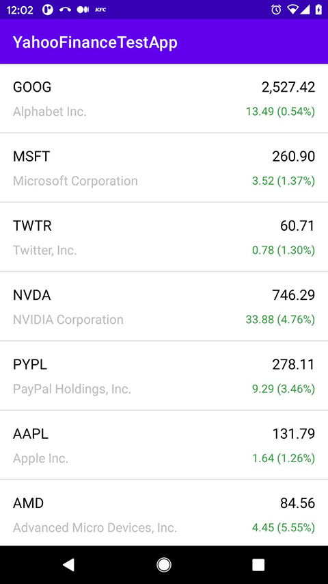
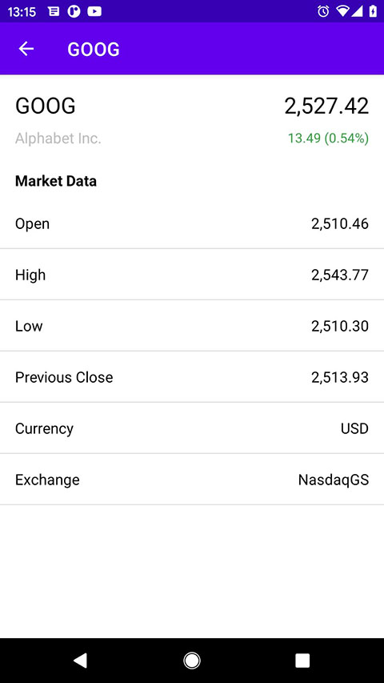

# YahooFinanceTestApp

This Android app is a simple demonstration of the layer architecture. It uses Domain, Data and Framework modules to implement different abstractions on each layer.

The next stack was used to develop this app: RxJava2 / Retrofit / Room / Dagger2 / LiveData & ViewModel (MVVM)

Screenshots

 

# Possible improvements

Current implementation ask Yahoo stocks only once. After response received, the app caching it in Room database and never update stocks from server anymore.
Of course, this solution is not effective. As examople, the solution could be improved by updating of the StockInteractor and asking for a new stock data when the saved timestamp is more than 15 minutes. 

On top of that, each stock have own timestamp. This means that we can check the timestamp for each stock and update it from the server if the value will be more than 15 minutes.
